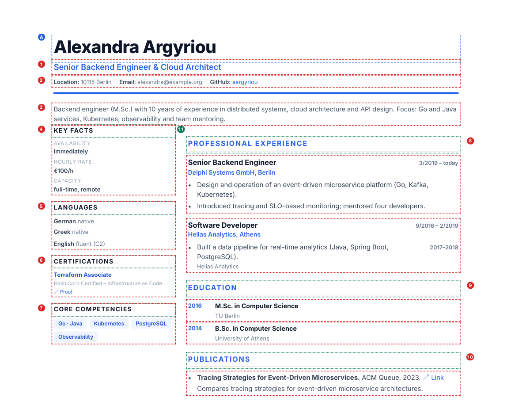

# Configuration reference

Ergograph reads exactly two kinds of file, and it helps to keep their roles apart:

| File | Role | How many |
|---|---|---|
| `config.yaml` | **Steering**: who the person is, which languages, variants and documents to build, where output goes | one per dossier folder |
| `content/<lang>.yaml` | **Content**: every text that appears in the documents, including the section headings | one per language |

Nothing else is needed — no templates, no code. `ergograph validate` checks both
files and reports the first problem with its file and field name.

## Which key produces which region

The numbers mark what each content key renders into. Boxes in red come from
`content/<lang>.yaml`, the green boxes are the headings from `labels`, and the
blue box is the one visible field that comes from `config.yaml`.



| # | Key | Type | Renders |
|---|---|---|---|
| A | `person.name` (config) | string | The name in the header |
| 1 | `title` | string | Job title under the name |
| 2 | `contact` | list of maps | Header line with location, mail, links |
| 3 | `tagline` | string | Summary paragraph above the two columns |
| 4 | `facts` | list of maps | Sidebar block: availability, rate, … |
| 5 | `languages` | list of maps | Sidebar block: language skills |
| 6 | `certs` | list of maps | Sidebar block: certificates |
| 7 | `top_skills` | list of strings | Sidebar block: core-competency tags |
| 8 | `experience` | list of maps | Main column: stations with bullets |
| 9 | `education` | list of maps | Main column: degrees |
| 10 | `publications` | list of maps | Main column: publication list |
| 11 | `labels` | map | Every heading, in both columns |

Two keys render into documents not shown above: `projects` builds the project
history, `skills` the skills matrix. `doc_names` never appears inside a document
— it supplies the PDF file names.

## `config.yaml`

Paths are relative to the location of the `config.yaml`.

| Field | Type | Required | Default | Meaning |
|---|---|---|---|---|
| `person.name` | string | **yes** | — | Name in the header and, slugged, in the file names |
| `person.file_slug` | string | no | `name` with `-` for spaces | Slug used in PDF file names |
| `person.anonymous_slug` | string | no | `profile` | Slug of anonymous variants, so their file names carry no name |
| `languages` | list of strings | **yes** | — | Language codes to build; must be non-empty |
| `content` | map: lang → path | **yes** | — | One content file per language listed above |
| `variants` | list of strings, or map name → options | no | `[default]` | Variant names, free-form (e.g. with/without rate); options see [Variants](#variants) |
| `documents` | list of strings, or map lang → list | no | `cv, projects, skills, full` | Which of `cv`, `projects`, `skills`, `full`, `onepager` to build |
| `theme` | string | no | `modern` | Bundled theme name, or a path to your own `.css` |
| `level_max` | number | no | `6` | Upper end of the skill-bar scale |
| `formats` | list of strings | no | `[pdf]` | Output formats to write: any of `pdf`, `docx`, `md` |
| `photo` | path, or `{file, documents?, languages?, files?}` | no | — | Photo in the header, see [Photo](#photo) |
| `output.html_dir` | path | no | `html` | Where the HTML intermediate goes |
| `output.pdf_dir` | path | no | `pdf` | Where the PDFs go |
| `output.docx_dir` | path | no | `docx` | Where the Word files go |
| `output.docx_font` | string | no | `Segoe UI` | Base font of the generated Word files |
| `output.md_dir` | path | no | `md` | Where the Markdown files go |
| `output.flat_dir` | path | no | — | Also copy every output into this one folder, see [Flat folder](#flat-folder) |
| `output.flat_documents` | list of strings | no | all built | Only these documents go into `flat_dir` |
| `output.date_prefix` | boolean | no | `true` | `YYYY-MM-DD_` in front of file names |
| `chrome` | path | no | auto-detected | Chrome/Chromium binary, if it is not found automatically |

Only `cv`, `projects`, `skills`, `full` and `onepager` are valid document keys;
anything else is rejected by name. `full` is the combined dossier: CV, then
project history, then skills matrix, each starting on its own page. `onepager`
is a landscape A4 page, see [One-pager](#one-pager); it is opt-in because it
needs its own content block.

`formats` selects what is written. HTML is always produced, because it is the
intermediate step of the PDF route; `pdf` renders it with Chrome, and `docx`
writes an editable Word file from the same content, with the same file-name
convention and the same section order. Word files need no Chrome, so
`--format docx` builds on a machine without a browser. Every Word file is
checked after writing: if a string from the YAML is not in its text layer, the
build fails.

```yaml
person:
  name: Alexandra Argyriou

languages: [de, en]
variants: [mit-stundensatz, ohne-stundensatz]

documents:              # a flat list applies to all languages
  de: [cv, projects, skills, full]
  en: [full]            # or one list per language

content:
  de: content/de.yaml
  en: content/en.yaml

formats: [pdf, docx]    # default is [pdf]

output:
  html_dir: .build/html
  pdf_dir: pdf
  docx_dir: docx
  date_prefix: false    # stable file names, older builds are overwritten
```

## `content/<lang>.yaml`

All fourteen top-level keys are required, but **every list may be empty** — an
empty list hides its section, which is how one format serves a software architect
and a carpenter alike. Values marked *HTML* are inserted into the page without
escaping: write `ü`, `€` and `…` directly, and use `<a href="…">…</a>` for inline
links (see SPEC D2).

### Top level

| Key | Type | Notes |
|---|---|---|
| `title` | string (HTML) | Job title in the header |
| `tagline` | string (HTML) | One paragraph, the professional summary |
| `labels` | map | Section headings, see below — all twelve keys required |
| `doc_names` | map | File name per document: `cv`, `projects`, `skills`, `full` required, `onepager` when it is built |
| `contact` | list of `{label, value, url?}` | `url` turns the value into a link |
| `facts` | list of `{label, value, variants?}` | Order is display order; `variants` limits a fact to those variants (works in every list, see [Variants](#variants)) |
| `onepager` | map | Only when `onepager` is built, see [One-pager](#one-pager) |
| `anonymous_name` | string | Only for anonymous variants: shown instead of the name |
| `anonymous_replace` | map text → text | Only for anonymous variants: generalizes employers, systems, places |
| `languages` | list of `{name, level}` | The person's language skills, as free text |
| `certs` | list of `{name, description?, url?}` | With `url`, a proof link is rendered |
| `top_skills` | list of strings | Rendered as tags |
| `education` | list of `{year, degree, institution}` | `year` is a string, so `'2016'` or `2014–2016` both work |
| `experience` | list of `{period, role, org, bullets}` | See bullets below |
| `publications` | list of `{title, venue, url?, summary?}` | `summary` is one sentence, rendered after the venue |
| `projects` | list of `{group, meta, items}` | See items below |
| `skills` | list of `{category, items}` | See items below |

### `labels` — required keys

`facts`, `languages`, `certs`, `core`, `experience`, `education`,
`publications`, `projects`, `skills`, `verify`, `link`, `legend`.

`core` is the heading for `top_skills`, `verify` and `link` label the proof links
of certificates and publications, and `legend` is the free-text caption under the
skills matrix explaining the scale. Because they live here and not in the code,
adding a language needs no code change (SPEC D5).

### `experience[].bullets`

A bullet is either a plain string, or a map for the cases where a single station
covers several clients:

| Field | Type | Required | Renders |
|---|---|---|---|
| `text` | string (HTML) | **yes** | The bullet text |
| `org` | string | no | Small subtitle line below the text |
| `period` | string | no | Right-aligned next to the text |

### `projects[].items[]`

| Field | Type | Required | Renders |
|---|---|---|---|
| `title` | string (HTML) | **yes** | Project title |
| `description` | string, or list of strings | **yes** | One paragraph, or one per list entry |
| `tech` | string (HTML) | **yes** | Technology line under the description |
| `period` | string | no | Right-aligned next to the title |
| `org` | string | no | Client or department, as a subtitle |

The surrounding group carries `group` (its heading, e.g. employer and role) and
`meta` (one line of context, e.g. `'03/2019 – heute · Berlin · Branche: Logistik'`).

### `skills[].items[]`

| Field | Type | Required | Renders |
|---|---|---|---|
| `name` | string | **yes** | Skill name |
| `level` | number | **yes** | Bar length on the scale up to `level_max`; fractions like `4.5` are allowed |
| `note` | string | no | Grey annotation next to the bar |

The level is printed as a number next to the bar as well, so applicant tracking
systems can read it (SPEC R15).

## Variants

A variant is a named build. In its short form `variants` is a list of names;
the mapping form adds options:

```yaml
variants:
  mit-stundensatz: {}
  ohne-stundensatz: {}
  anonym: {anonymous: true, documents: [cv, onepager]}
  fokus-architektur: {tags: [architektur], documents: [cv, onepager]}
```

| Option | Default | Meaning |
|---|---|---|
| `tags` | `[]` | Extra tags; a variant's own name is always a tag, an anonymous one also has `anonymous` |
| `anonymous` | `false` | No name, no contact block, no photo, no links; see below |
| `documents` | all configured | Restricts the documents built for this variant |
| `photo` | `true` | `false` leaves the photo out of this variant |

The content file reacts to the active tags in three ways:

- **Any list entry** (a mapping) may carry `variants: [tag, …]` (kept only when
  one of them is active) and/or `except_variants: [tag, …]` (dropped when one of
  them is active). This works in `facts`, `experience`, `projects`, `certs`,
  `publications`, the one-pager block, everywhere.
- **Any value** may be written as `{by_variant: {<tag>: value, …, default: value}}`.
  The first key whose tag is active wins, otherwise `default`; a missing
  `default` is an error when no key matches.
- **Anonymous variants** replace the name by `anonymous_name`, drop the contact
  block, the photo and every link (a badge URL or a DOI identifies a person as
  well as the name does), and apply `anonymous_replace` to every value, longest
  key first. The build then **verifies** the anonymity: if a part of the name,
  a contact value or a key of `anonymous_replace` appears anywhere in the HTML,
  PDF, DOCX or Markdown text, the build fails.

```yaml
title:
  by_variant:
    architektur: Software Architect
    default: Software Architect & Lead Developer

publications:
- except_variants: [anonymous]
  title: …

anonymous_name: Candidate profile
anonymous_replace:
  Nordwind Telematik GmbH: software company (telematics)
  Nordwind: software company
```

## Photo

```yaml
photo:
  file: photos/portrait.jpg        # JPEG or PNG
  documents: [cv, full, onepager]  # default
  languages: [de, en]              # default: all
  files:
    onepager: photos/half-body.jpg # another file for one document
```

A plain path (`photo: portrait.jpg`) is short for `{file: portrait.jpg}`. The
file is embedded **unchanged**: no scaling and no re-encoding, so the PDF and the
DOCX carry the original pixels. Prepare the crop and size you want (a 4:5
portrait of about 1000 px width is plenty for the 25 mm header photo). The
header shows it top right at 25 mm width, the one-pager at 30 mm; the height
follows the image. The EXIF orientation is not applied, so save the file upright.

## One-pager

A landscape A4 page that shows at a glance what the person can do. It has to fit
on **one page**: if it runs over, the build fails. Contact, facts, certificates
and languages come from the normal keys; the block `onepager` adds the rest:

| Key | Type | Notes |
|---|---|---|
| `labels` | `{competencies, projects, timeline}` | Required |
| `summary` | string (HTML) | Default: `tagline` |
| `facts` | list of labels | Which facts to show, in this order; default: all |
| `highlights` | list of `{value, label}` | Key figures in a row of tiles, e.g. `12+` / `years of experience` |
| `competencies` | list of `{name, level?, items}` | Clusters with a level bar and tags |
| `projects` | list of `{ref?, title?, period?, org?, role?, bullets, tech?}` | `ref` names the `id` of a `projects[].items[]` entry; every other field falls back to it |
| `extra` | list of `{title, items}` | Further boxes in the right column, e.g. publications |
| `timeline` | list of `{period, label, sub?}` | Stations along the bottom, oldest first |

The one-pager is written as PDF and Markdown; `docx` skips it (a multi-column
landscape page is not reproduced in Word).

## Flat folder

`output.flat_dir` copies every PDF, DOCX and Markdown file of a build into one
folder, with the variant in the name when there is more than one:
`2026-09-24_Daniel-Falkner_cv_ohne-stundensatz_en.pdf`. An earlier build of the
same document (same name, any date) is replaced, so the folder always holds the
current state. The per-variant folders are written as before.
`output.flat_documents` limits the folder to some documents, e.g.
`[full, onepager]`: everything is still built, only the picking folder is smaller.

## Editor support

The repository ships JSON Schemas for both file types, so an editor can offer
completion and flag unknown or mistyped fields while you write. Point the YAML
language server at them with a comment on the first line:

```yaml
# yaml-language-server: $schema=https://raw.githubusercontent.com/Supportlik/Ergograph/main/schemas/content.schema.json
title: Senior Backend Engineer
```

Or, in VS Code, map them once in `settings.json`:

```json
{
  "yaml.schemas": {
    "https://raw.githubusercontent.com/Supportlik/Ergograph/main/schemas/config.schema.json": ["config.yaml"],
    "https://raw.githubusercontent.com/Supportlik/Ergograph/main/schemas/content.schema.json": ["content/*.yaml"]
  }
}
```

The schemas are checked against every bundled example by the test suite, so they
cannot drift away from what the loader actually accepts.

## Checking your files

```bash
ergograph validate               # config plus every content file
ergograph build --html-only      # render without Chrome, fastest full check
ergograph build --strict         # PDFs, and fail if the ATS check finds gaps
```

## Generating content with an AI agent

The format is deliberately plain YAML with a flat, named structure, and every
text lives outside the code. That makes it a good target for an agentic coding
tool — Claude Code, Codex, Cursor, Aider or similar: the agent has a machine-
readable contract (the JSON Schemas), a reference (this document), working
examples (`examples/`), and two commands that tell it objectively whether the
result is correct.

The loop that makes this work:

```bash
ergograph validate          # is the structure valid? names the offending field
ergograph build --strict    # do the PDFs render, and is every string ATS-readable?
```

`--strict` is the useful gate: it fails when a string from the YAML cannot be
extracted from the finished PDF, so an agent can iterate until the document is
provably complete rather than until it looks plausible.

### A prompt that works

Point the agent at the contract and at your source material, and be explicit
that it must not invent anything:

```text
Create content/en.yaml for the CV generator "ergograph" from the source
material in <my-old-cv.pdf / linkedin-export.txt>.

Rules:
- Follow schemas/content.schema.json exactly: all 14 top-level keys, all 12
  keys under labels, all 4 under doc_names.
- Use only facts present in the source. Do not invent employers, dates,
  certificates, degrees or skill levels. If something is missing, leave the
  list empty rather than filling it in.
- Skill levels: only where the source supports them, on the scale 1 to
  level_max from config.yaml.
- Values are HTML fragments: write ü, €, — directly; use <a href="…">…</a>
  only for links that exist in the source.
- Keep every text in the language of the file.

Then run `ergograph validate` and `ergograph build --strict` in that folder
and fix what they report, until both pass.
```

For a second language, the same works with "translate `content/de.yaml` into
`content/en.yaml`, keep the structure identical, translate the `labels` and the
`doc_names` too" — the file names in the output are localized through
`doc_names`, so nothing else needs touching.

### What to check yourself afterwards

An agent formats reliably and invents plausibly, so the review is about facts,
not about YAML:

- **Numbers and dates**: periods, years, skill levels. These are what a reader
  checks first and what a model is most likely to smooth over.
- **Certificates and degrees**: exact titles, and whether the `url` really
  proves the thing next to it.
- **Anything absolute** ("first", "largest", "responsible for"), which tends to
  drift upwards in generated prose.

`ergograph validate` proves the file is well-formed and `--strict` proves it is
machine-readable. Neither proves that it is true — that part stays with you.
